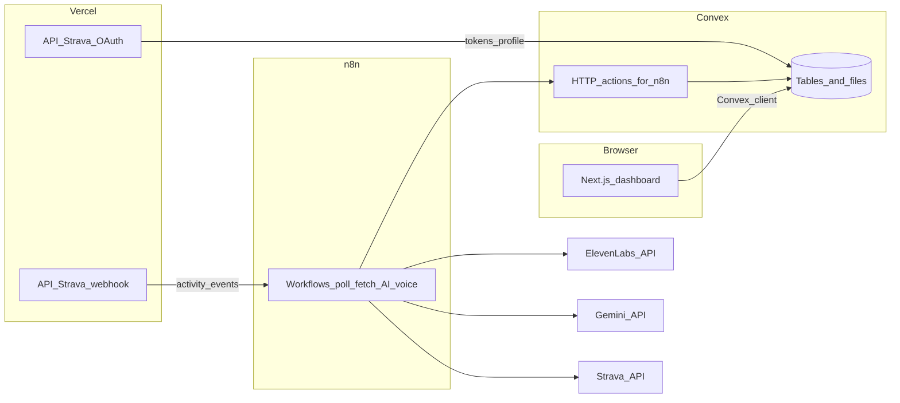

# DD-001: Application architecture plan

**Status:** Draft (living document — edit here; Cursor plan copy may lag)  
**Last updated:** 2026-03-21  
**Related:** [AGENTS.md](../../AGENTS.md), [docs/index.md](../index.md), [IP-001 MVP overview](../prd/IP-001-coachagent-mvp.md)

This file is the **canonical in-repo** architecture and contract-prep plan. Improve it via PRs like any other doc.

---

## Action checklist (from planning session)

| ID                   | Task                                                                                                                                                         |
| -------------------- | ------------------------------------------------------------------------------------------------------------------------------------------------------------ |
| scaffold-ip001a      | Execute IP-001a: Next.js App Router, Convex, shadcn, lib folders per [IP-001a](../prd/IP-001a-scaffolding.md)                                                |
| implement-data-layer | Add `convex/schema.ts` + HTTP actions + token/activity mutations from IP-001                                                                                 |
| wire-integrations    | Strava OAuth + webhook routes; n8n workflows hitting Convex HTTP + external APIs                                                                             |
| align-prd-polling    | Reconcile PRD-001 polling interval with IP-001c (3–5 min) in docs when implementing                                                                          |
| fe-api-surface       | Add Convex public API catalog per recorded decisions: domain modules, split queries, Strava id in routes, optional voice; stub `convex/` for generated types |
| chat-threads-scope   | Extend schema + contract for multiple coach chats (shared base context, per-thread history); not in current IP-001 schema                                    |
| mvp-voice-optional   | MVP: pipeline and UI work without voice; keep voice in plan (IP-001i), hide or stub player until `storageId` present                                         |
| decide-data-layer    | ~~Choose Convex vs Vercel Postgres~~ — **done: Convex**                                                                                                      |

---

# CoachAgent architecture (current docs vs repo)

## Project setup today

| Area                               | Status                                                                                         |
| ---------------------------------- | ---------------------------------------------------------------------------------------------- |
| [package.json](../../package.json) | Tooling only: TypeScript, ESLint, Prettier, Vitest, Husky — **no** Next.js, Convex, or UI deps |
| [src/index.ts](../../src/index.ts) | Placeholder (`export {}`)                                                                      |
| `app/`, `convex/`                  | **Not present** — planned in [IP-001a](../prd/IP-001a-scaffolding.md)                          |

So: **architecture is specified in docs** ([AGENTS.md](../../AGENTS.md), [PRD-001](../prd/PRD-001-coachagent-mvp.md), [IP-001](../prd/IP-001-coachagent-mvp.md)); **implementation has not started** beyond the shared TS/Vitest baseline.

**Architecture decision:** Persist with **Convex** for database, server functions, file storage, and realtime dashboard subscriptions. No Vercel Postgres path for MVP.

---

## Do you need a database?

**Yes.** The product stores athletes, OAuth tokens, activities, downsampled streams, analyses, weekly/form aggregates, and audio file references. The chosen system is **[Convex](https://www.convex.dev/)**: it is both the **database** (tables, indexes, queries) and the **server runtime** for mutations, queries, and secured HTTP endpoints. You do **not** need a separate Postgres instance for the MVP as documented; Convex is the single source of truth.

The canonical schema lives in [IP-001](../prd/IP-001-coachagent-mvp.md) (tables: `athletes`, `stravaTokens`, `activities`, `activityStreams`, `analyses`, plus related tables for zones, voice, weekly, form, etc.).

---

## Reference: Vercel-only backend + database (not chosen)

_Included for future comparison; MVP stays on Convex._

**Short answer:** Vercel is the **host** for your Next.js **backend code** (Route Handlers, Server Actions, optional Edge Middleware). Vercel does **not** ship a first-party document database like Convex; “database on Vercel” usually means a **managed integration**, most often **[Vercel Postgres](https://vercel.com/docs/storage/vercel-postgres)** (Neon under the hood), plus **[Vercel Blob](https://vercel.com/docs/storage/vercel-blob)** for MP3s or large payloads. That path is a **different architecture** than the PRD/IP docs (Convex + n8n).

| Concern                        | Documented approach (Convex)                     | Vercel-centric approach                                                                                                                                                                                                                              |
| ------------------------------ | ------------------------------------------------ | ---------------------------------------------------------------------------------------------------------------------------------------------------------------------------------------------------------------------------------------------------- |
| **API / business logic**       | Convex queries, mutations, HTTP actions          | Next.js Route Handlers + Server Actions (Node or Edge runtime)                                                                                                                                                                                       |
| **Database**                   | Convex tables / indexes                          | Postgres + ORM (e.g. Drizzle, Prisma) — map IP-001 schema to SQL tables                                                                                                                                                                              |
| **Realtime dashboard**         | Built-in Convex subscriptions                    | Roll your own (polling, SSE) or add a realtime layer (e.g. Supabase Realtime, Pusher, Ably)                                                                                                                                                          |
| **Audio files**                | Convex file storage + URLs                       | Vercel Blob or S3-compatible storage                                                                                                                                                                                                                 |
| **Long / multi-step pipeline** | n8n + Convex HTTP (no serverless timeout on n8n) | Still favor **n8n**, **Inngest**, **Trigger.dev**, or **QStash** for Strava+Gemini+TTS chains — a single Vercel function can hit **execution time limits** and is a poor fit for “fetch streams → downsample → Gemini → upload audio” as one request |
| **n8n calling “backend”**      | Secured Convex HTTP endpoints                    | Secured Next.js API routes (shared secret or signed JWT) that read/write Postgres                                                                                                                                                                    |

**Practical takeaway:** You can put **backend and database on Vercel** in the sense of “one deployment surface + Neon Postgres + Blob.” You still need a **workflow runner** (keep n8n, or replace with a jobs product) for reliable long-running integration work unless you split the pipeline into small async steps with a queue.

If that path were chosen later, **AGENTS.md**, PRD-001, and IP-001\* would need rewrites so agents do not assume Convex.

---

## What “backend” means in this stack

Three cooperating backends, each with a narrow role:

1. **Convex** — Data + business rules exposed to the dashboard (React hooks / Convex client), **restricted** token storage, processing status, file storage for MP3s, and **HTTP actions** callable from n8n with a shared secret ([IP-001c](../prd/IP-001c-activity-trigger.md), [IP-001a](../prd/IP-001a-scaffolding.md) lists `convex/http.ts`).
2. **Next.js (Vercel)** — **Edge-friendly API routes** for things that must be public HTTPS endpoints: Strava OAuth redirect/callback and Strava webhook verification + lightweight POST handling ([IP-001a](../prd/IP-001a-scaffolding.md): `app/api/auth/strava/`, `app/api/webhooks/strava/`).
3. **n8n** — **Orchestration** and **integration hub**: scheduled poll (or consume webhook forwards), call Strava with refreshed tokens, downsample streams, call **Gemini** ([IP-001e](../prd/IP-001e-ai-analysis.md)), call **ElevenLabs** ([IP-001i](../prd/IP-001i-voice-debrief.md)), upload audio via Convex upload URLs, advance `processingStatus` through the pipeline ([AGENTS.md](../../AGENTS.md) flow).

Strava tokens must stay **server-side** (Convex restricted table + server/n8n usage only) — see [AGENTS.md](../../AGENTS.md) anti-patterns.

---

## How everything connects (target)

**End-to-end pipeline** (from [AGENTS.md](../../AGENTS.md)):

1. New activity: webhook (Vercel) or poll (n8n → Convex HTTP) discovers work.
2. n8n fetches activity + streams from Strava; downsamples; writes to Convex.
3. Gemini produces structured coaching JSON; stored in Convex.
4. ElevenLabs generates audio; uploaded to Convex storage; UI subscribes reactively.

---

## Implementation order (already sequenced in docs)

Follow [docs/index.md](../index.md): **IP-001a** scaffold Next + Convex + UI deps, then **IP-001b** OAuth, **IP-001c** trigger, **IP-001d** fetch/store, **IP-001e** AI, dashboard slices **IP-001f–h**, **IP-001i** voice.

---

## Risks / decisions to keep in mind

- **Strava rate limits** (100/15min, 1000/day): polling interval and concurrency must match [IP-001c](../prd/IP-001c-activity-trigger.md) (e.g. 3–5 min poll, not aggressive 60s as in older PRD wording).
- **PRD vs IP-001c**: PRD-001 still mentions “60s” polling; IP-001c is the stricter plan — align when implementing.
- **n8n hosting**: docs assume a running n8n instance with env secrets (Strava, Gemini, ElevenLabs, Convex deployment URL, internal bearer token). That is infrastructure outside the repo until you document/deploy it.

---

## Frontend parallel work: is this plan enough for “API contracts”?

**Verdict:** The **architecture plan alone is not sufficient** to define stable contracts for the frontend. It explains _where_ data lives (Convex vs Next vs n8n), not the **callable surface** the UI will use day to day.

**What you already have (elsewhere in docs — use these for mocks and types):**

| Asset                                 | Where                                                                         | Use for FE                            |
| ------------------------------------- | ----------------------------------------------------------------------------- | ------------------------------------- |
| Table shapes / fields                 | [IP-001](../prd/IP-001-coachagent-mvp.md) `defineSchema`                      | DTOs, mock fixtures, form field names |
| Processing status enum                | Same doc + `types/processing-status.ts` snippet                               | Status badges, loading pipelines      |
| Gemini → stored analysis (conceptual) | `CoachingAnalysisV1` + `analyses` table in IP-001                             | Coaching cards, lists                 |
| Screen ↔ field mapping                | [IP-001f](../prd/IP-001f-dashboard-workout.md) (and siblings for week / form) | Component props, stat sources         |
| Parallel FE note                      | IP-001 dependency graph: dashboard “can start with mock data”                 | Validates mock-first approach         |

**What is still missing for a real “contract” (should be added before FE treats shapes as frozen):**

1. **Convex public API catalog** — Named `query` / `mutation` (and any `action`) exports: arguments, return validators, and which **read models** they produce (e.g. “latest activity + analysis + stream metadata + voice URL,” not just raw table rows). The schema does not imply function names or joins.
2. **Auth / session contract** — How the dashboard resolves the **current athlete** (Convex Auth, custom JWT, Strava-only session, etc.) and which functions are `public` vs user-scoped. Not specified in the architecture plan.
3. **Next.js routes used by the browser** — OAuth start/callback URLs and redirect parameters; any client-visible JSON from those routes (if any). Webhook routes are server-to-server only.
4. **Stable IDs** — **Recorded:** browser routes use **Strava activity id** (string) for deep links; Convex `Id<'activities'>` stays internal. Convex document ids cannot be forced equal to Strava ids (different generators).

**How teams usually “contract” with Convex (no separate OpenAPI for DB reads):**

- Implement **stub** `convex/*.ts` functions with `args` / `returns` validators (or `v.object` shapes), run `npx convex dev` once, and treat **`convex/_generated/api` + `DataModel`** as the source of truth for TypeScript on the client.
- Optionally maintain a short **`docs/design/DD-NNN-convex-public-api.md`** listing function names and intent for humans and non-TypeScript consumers.

**Bottom line:** Frontend can **start UI and mocks** using IP-001 schema + IP-001f–h field mapping **today**. To wire real data without churn, add the **Convex function catalog + auth story** (or stub Convex and use generated types) — tracked as **fe-api-surface** above.

---

## Pre-contract questionnaire (answer before freezing the contract)

Use this as a checklist; copy answers into `docs/design/DD-NNN-convex-public-api.md` (or equivalent) when done. **Many items already have decisions in [Recorded contract decisions](#recorded-contract-decisions-stakeholder-answers) below;** remaining gaps are listed under **Still open** there.

### Auth and identity

1. **Primary auth provider for the dashboard** — Convex Auth, Clerk, Auth.js, custom session cookie, or “Strava OAuth only” with no separate app account?
2. **Stable user key** — What becomes `athletes.authSubject` (and who issues it)?
3. **Multi-provider later** — Do we need a contract that allows linking Strava to an email/password user, or is one Strava athlete ↔ one app user forever for MVP?
4. **Unauthenticated experience** — What can `public` queries return (marketing page only vs partial previews)?
5. **Session lifetime / refresh** — Any contract for “reconnect Strava” or token expiry surfaced to the UI?

### Convex public API shape

6. **Naming convention** — Prefix by domain (`activities.*`, `athletes.*`) or feature (`dashboard.*`)?
7. **Pagination** — Cursor-based, offset, or “load last N activities” only for MVP?
8. **Sort defaults** — e.g. latest activity by `startDate` ISO string vs server timestamp; tie-breakers?
9. **Nullable vs missing fields** — Do we return `null` for optional metrics or omit keys (affects TS and mocks)?
10. **Error contract** — Throw `ConvexError` with codes/messages the UI maps to toasts, or generic failures only?

### Read models (what each query returns)

11. **Workout detail** — Single query for activity + analysis + downsampled stream + zones + gear + voice metadata, or multiple queries the client composes?
12. **Latest workout list** — Does the default dashboard need only the head activity or a short list (e.g. last 7) for navigation?
13. **Weekly view** — How is “current week” chosen (`weekStartLocal` convention, athlete timezone, Monday vs Sunday)?
14. **Coach Status / form** — Single snapshot query (CTL/ATL/TSB + sparkline series) or split time-series vs summary?
15. **Processing pipeline** — Does the client poll a status field only via realtime subscription, or do we expose explicit “retry” / “skip voice” mutations in v1?

### IDs and routing

16. **URL id for `/dashboard/workout/[activityId]`** — Convex `Id<'activities'>` (string) or Strava activity id (number/string)? If Strava id, how do we guarantee uniqueness and lookups?
17. **Internal ids in nested objects** — Are `_id` fields always included on child records the UI might link to?

### Files and media

18. **Voice / audio URL** — `query` that returns a fresh signed URL from `storageId`, embedded URL in a parent read model, or client calls `getUrl` pattern — and **TTL / refresh** expectations for the player?
19. **Placeholders** — Contract when audio is not ready yet (`generating_audio`) vs missing (`null`)?

### Next.js (browser-facing) routes

20. **OAuth start** — Exact path(s) (e.g. `GET /api/auth/strava`) and whether the client uses `<a href>` or `fetch` + redirect?
21. **OAuth callback** — Success redirect target, error query params, and whether the callback sets a cookie vs redirects with a token?
22. **Post-OAuth deep link** — Always land on `/dashboard` or preserve `returnTo`?

### Time, locale, and units

23. **Server vs client unit conversion** — Server stores SI only and FE converts using `measurementPreference`, or server returns both?
24. **Date/time fields** — Always ISO 8601 strings; clarify which are UTC vs local (`startDate` vs `startDateLocal`) for display contracts.

### MVP scope and versioning

25. **Tables in v1 contract** — Are `weeklyAnalyses`, `formAssessments`, `formSnapshots`, `gear` all in the first shipped API surface or phased?
26. **Analysis schema version** — Do we expose `model` / `schemaVersion` on analysis objects for forward compatibility?
27. **Breaking change policy** — Additive-only validators, or allow renames with a version bump field?

### Security and boundaries

28. **What never crosses the client** — Confirm `stravaTokens` and raw refresh tokens are absent from all query return types (contract review checklist).
29. **n8n / HTTP actions** — List which endpoints exist and confirm they are **not** part of the browser contract (only server-to-server).

### Observability (optional but contract-relevant)

30. **Client-correlation** — Do we pass `clientRequestId` anywhere, or rely on Convex defaults only?

---

## Recorded contract decisions (stakeholder answers)

Captured from product Q&A. Use this block as input when writing `docs/design/DD-NNN-convex-public-api.md` and stub Convex functions.

### Auth and identity

| Topic                                | Decision                                                                                                                                                                                                                                                                                                                                                                                                                                                                                                                                        |
| ------------------------------------ | ----------------------------------------------------------------------------------------------------------------------------------------------------------------------------------------------------------------------------------------------------------------------------------------------------------------------------------------------------------------------------------------------------------------------------------------------------------------------------------------------------------------------------------------------- |
| **Strava-only vs extra account**     | Prefer **as simple as possible: Strava as the identity** for MVP. A separate email/password (or social) account is only needed if you want: users who do not use Strava, login when Strava is unavailable, or one login spanning multiple data sources. If you add an app account later, **Convex Auth** is the natural fit alongside Convex.                                                                                                                                                                                                   |
| **`authSubject` / stable user key**  | Strava’s OAuth [token exchange](https://developers.strava.com/docs/authentication/) returns an **`athlete` object with numeric `id`**. That id is the usual **stable per-athlete identifier** in the Strava API. **Recommendation:** set `athletes.stravaAthleteId` from that value (stringified) and set `athletes.authSubject` to a **deterministic string** such as `strava:<athleteId>` **or** the subject issued by Convex Auth if you use it to hold the browser session—**but** the Strava id remains the canonical link to Strava data. |
| **Replaceability**                   | Keep **boundaries thin**: auth, LLM, TTS, and Strava client behind small modules (`lib/...`) so implementations can swap without rewriting the whole app.                                                                                                                                                                                                                                                                                                                                                                                       |
| **Unauthenticated `public` surface** | **Login / landing page** only for anonymous users (marketing + “Connect with Strava”); no sensitive or personalized Convex data without session.                                                                                                                                                                                                                                                                                                                                                                                                |
| **Reconnect UX**                     | When tokens cannot be refreshed or Strava returns auth errors, surface a **generic** message and a **“Reconnect Strava”** path (new OAuth).                                                                                                                                                                                                                                                                                                                                                                                                     |

### Convex API shape

| Topic               | Decision                                                                                                                                                                                                                                                                                                  |
| ------------------- | --------------------------------------------------------------------------------------------------------------------------------------------------------------------------------------------------------------------------------------------------------------------------------------------------------- |
| **Naming**          | **Domain-driven** modules (e.g. `activities`, `athletes`, `analyses` — exact file layout matches Convex conventions).                                                                                                                                                                                     |
| **Pagination (Q7)** | **Purpose:** avoid loading unbounded rows for **activity history**, future **chat message** lists, and any large table. **MVP:** use fixed **“last N”** (e.g. recent activities for dashboard nav) without a full cursor protocol until a screen needs true pagination; document `limit` on list queries. |
| **Sort**            | **Latest first** (e.g. by activity `startDate` descending; define tie-breaker e.g. `stravaActivityId` or `_creationTime` if needed).                                                                                                                                                                      |
| **Optional fields** | **Omit keys** when a metric is absent (not `null`), unless Convex validators require presence—then prefer `v.optional` and omit in returned objects where possible.                                                                                                                                       |
| **Errors**          | **Log** structured errors in a **central** place (Convex logs + optional external logger); **client** sees only a **generic** failure message (no stack traces or provider payloads).                                                                                                                     |

### Read models and features

| Topic                    | Decision                                                                                                                                                                                                                                                                                                                                                                                                                        |
| ------------------------ | ------------------------------------------------------------------------------------------------------------------------------------------------------------------------------------------------------------------------------------------------------------------------------------------------------------------------------------------------------------------------------------------------------------------------------- |
| **Workout detail**       | **Split queries** — client composes (e.g. activity, stream, analysis, zones, gear, voice meta as separate queries) to keep each function small and cache-friendly.                                                                                                                                                                                                                                                              |
| **Dashboard list**       | **Yes** — return a **short list** (e.g. last 7 or last N) for navigation, not only the single latest activity.                                                                                                                                                                                                                                                                                                                  |
| **Weekly boundary**      | Anchor on **`weekStartLocal`** (string) as already in schema; **which weekday** starts the week and how athlete timezone is applied should still be fixed in the contract doc (remaining detail from pre-contract Q13/Q24).                                                                                                                                                                                                     |
| **Coach / form vs chat** | **New requirement:** support **multiple chat threads** that share the **same base context** (athlete profile, goals, recent activity summary) but maintain **separate chat histories**. This is **not** in current [IP-001](../prd/IP-001-coachagent-mvp.md) schema—plan **new tables** (e.g. `conversations`, `messages`) and a **`chat` domain** in Convex. Coach Status / CTL-ATL-TSB can remain separate queries from chat. |
| **Voice**                | **Keep in product plan**; **MVP must work without voice** (no ElevenLabs dependency for a usable release). UI treats audio as **optional**: if no `storageId` / URL, omit or disable player; pipeline may end at `complete` without `generating_audio` for MVP or skip that stage.                                                                                                                                              |

### IDs and routing

| Topic                       | Decision                                                                                                                                                                                                                                                                                                                                 |
| --------------------------- | ---------------------------------------------------------------------------------------------------------------------------------------------------------------------------------------------------------------------------------------------------------------------------------------------------------------------------------------- |
| **Convex id == Strava id?** | **No.** Convex `Id<'activities'>` values are **generated by Convex** and cannot be set to Strava’s numeric ids. **Practice:** use **Strava activity id in the URL** (as string); resolve the row with the existing **unique index** on `stravaActivityId`. Expose both ids in API responses if the client needs Convex id for mutations. |
| **Nested `_id`**            | **Yes** — include `_id` on nested documents when the UI might link or patch them.                                                                                                                                                                                                                                                        |

### Files / voice (18–19)

| Topic             | Decision                                                                                                                                                                                                                      |
| ----------------- | ----------------------------------------------------------------------------------------------------------------------------------------------------------------------------------------------------------------------------- |
| **Best practice** | Resolve **short-lived URLs** from `storageId` via a **dedicated query** (or small helper) when the player mounts or before play; **refresh** if playback exceeds TTL. Do **not** embed long-lived URLs in every list payload. |
| **States**        | If status is `generating_audio`, show non-blocking “preparing audio” or hide player; if no voice in MVP, status may jump to `complete` without audio—**omit** audio fields from payload when absent (**omitted keys**).       |

### Still open for the written contract (not answered above)

- **Coach Status / form queries** — Split vs single snapshot was superseded in discussion by **multi-chat**; confirm whether CTL/ATL/TSB + sparklines remain **split queries** like workout detail (recommended: yes, consistent with Q11).
- **Pipeline mutations (Q15)** — e.g. explicit **retry** or **skip voice** in v1, or status-only + realtime.
- **Next.js OAuth** routes: exact paths, `returnTo`, cookie vs redirect (pre-contract Q20–22).
- **Units** (Q23): SI-only server vs dual fields.
- **Date/time display** (Q24): full convention for UTC vs local beyond `weekStartLocal`.
- **v1 table scope** (Q25): which of weekly/form/gear ship in first API cut.
- **Analysis versioning** (Q26–27).
- **n8n HTTP route inventory** for security review (Q29).
- **Client correlation** (Q30).
