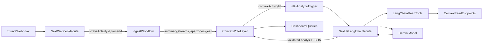

# DD-003: LangChain Gemini Workout Agent

**Status:** Implemented  
**Last updated:** 2026-03-21  
**Related:** [docs/index.md](../index.md), [DD-001](./DD-001-application-architecture-plan.md), [IP-001c](../prd/IP-001c-activity-trigger.md), [IP-001d](../prd/IP-001d-fetch-data.md), [IP-001e](../prd/IP-001e-ai-analysis.md), [IP-001f](../prd/IP-001f-dashboard-workout.md)

This file is the canonical in-repo design for the single-workout Gemini agent. It replaces the ad hoc planning note with a repository-owned architecture decision and implementation plan.

---

## Decision Summary

Build the first workout-analysis agent with this split:

1. **Strava webhook + n8n ingest** detect and fetch new activities.
2. **Convex** remains the system of record and exposes bounded server-only data access.
3. **Next.js** hosts a LangChain-based Gemini analysis route for one workout at a time.
4. **LangChain tools are read-only** in v1.
5. **Trusted server code** persists analysis results and updates status after validation.

This keeps long-running fetch/orchestration in `n8n`, keeps domain data in Convex, and gives the Gemini step a real tool-calling runtime without letting the model write to the database directly.

---

## Why This Shape

### Chosen architecture

- `n8n` is already the planned orchestration layer for webhook-driven and retry-heavy integration work.
- A Next.js server route is a better home for LangChain than `n8n` because tool definitions, schemas, and prompt code can live in TypeScript next to the app.
- Convex already models the right entities in `convex/schema.ts`, but it does not yet expose the workout-facing functions the agent needs.

### Why not direct n8n -> Gemini only

- Fixed n8n HTTP nodes work for a single prompt, but they become awkward once the model needs selective lookups like recent comparable workouts, zones, or form context.
- Tool descriptions, Zod validation, and prompt code are easier to evolve in application code than in workflow JSON.

### Why not LangChain everywhere

- `n8n` is still the better place for webhook processing, Strava fetch sequencing, backoff, and future voice orchestration.
- LangChain should be limited to the workout-analysis runtime, not the whole pipeline.

---

## Runtime Boundaries

### n8n

- Receives the forwarded Strava activity event.
- Fetches activity summary, streams, laps, zones, and gear from Strava.
- Downsamples streams.
- Persists fetched workout payload to Convex.
- Triggers the Next.js workout-analysis route with `convexActivityId`.
- Handles retry orchestration for network failures and non-terminal pipeline errors.

### Next.js

- Hosts `app/api/ai/analyze-workout/route.ts`.
- Creates the LangChain model and binds read-only workout tools.
- Validates the final Gemini output with Zod.
- Calls trusted persistence helpers after validation.

### Convex

- Stores `activities`, `activityStreams`, `analyses`, `athleteZones`, `gear`, and optional `formSnapshots`.
- Exposes internal query/mutation helpers by domain module.
- Exposes a narrow server-only HTTP wrapper for trusted callers.

---

## End-to-End Flow

### Sequence

1. Strava sends an `activity.create` event.
2. `app/api/webhooks/strava/route.ts` verifies and forwards the event to `n8n`.
3. `n8n` fetches the workout from Strava, downsamples streams, and stores the payload in Convex.
4. `n8n` POSTs `convexActivityId` to `app/api/ai/analyze-workout/route.ts`.
5. The route sets `processingStatus = "analyzing"`.
6. LangChain calls bounded Convex-backed read tools as needed.
7. Gemini returns a structured workout analysis.
8. Server code validates it with Zod.
9. Server code upserts the analysis and advances `processingStatus`.
10. The dashboard reads the stored analysis through normal Convex queries.

---

## LangChain Runtime

Use a minimal LangChain stack for v1:

- `@langchain/core`
- `@langchain/google`

Do not add broader orchestration layers unless the single-workout flow actually needs them.

### Model policy

- Use a fast Gemini model for per-workout analysis, starting with `gemini-2.0-flash` or the current flash equivalent exposed by `@langchain/google`.
- Temperature: `0.3`
- Output mode: structured output / tool-calling flow

### Guardrails

- LangChain tools are **read-only**.
- Writes are performed by trusted route code, not by the model.
- Schema validation runs before any analysis persistence.
- On schema failure, retry once, then mark the activity `error`.

---

## Tool Inventory

These functions should exist as Convex domain helpers first, then be wrapped as server-side LangChain tools.

### Required read tools

- `resolveActivityForAnalysis(stravaActivityId)`
  - Converts Strava route identity into internal Convex identity.
- `getActivitySummary(activityId)`
  - Returns workout summary fields needed for prompting.
- `getDownsampledStreams(activityId)`
  - Returns bounded stream arrays and metadata.
  - Prefer `downsampled`; fall back to `full` only if needed internally.
- `getAthleteProfileForActivity(activityId)`
  - Returns athlete goal and physiological context.
- `getLatestHeartRateZones(activityId)`
  - Returns current heart-rate zones for zone analysis.
- `getGearForActivity(activityId)`
  - Returns the linked gear record if present.

### Recommended enrichment tools

- `getPreviousComparableActivity(activityId)`
- `getRecentCompletedActivities(activityId, limit?)`
- `getFormSnapshotForActivityDate(activityId)`
- `getExistingAnalysis(activityId)`

### Tool adapter rules

- Every tool needs a thin server adapter under `lib/ai/langchain/tools/`.
- Tool descriptions should describe intent, not storage details.
- Tool responses should stay small and serializable.
- Avoid a single giant "load everything" tool for the agent path.

---

## Trusted Write Operations

These are not LangChain tools. They are server-controlled operations invoked outside the model loop.

- `setActivityStatus(activityId, status, error?)`
- `saveFetchedActivityPayload(...)`
- `saveAnalysis(activityId, analysis)`
- `updateFitnessFromActivity(activityId)` when fitness context is included
- `markActivityError(activityId, codeOrMessage)`

### Persistence rules

- `saveAnalysis` must upsert by `activityId`.
- Status transitions must remain deterministic across retries.
- The route should move from `analyzing` to `generating_audio` only if voice is enabled; otherwise it can move directly to `complete`.

---

## Analysis Contract

Adopt the explicit analysis shape from [IP-001e](../prd/IP-001e-ai-analysis.md).

### Expected fields

- `effortScore`
- `executiveSummary`
- `positives`
- `improvements`
- `hrZoneAnalysis`
- `splitAnalysis`
- `nextSession`
- `weatherNote`
- `voiceSummary`

### Prompt inputs

- athlete profile and goal
- workout summary
- splits
- zone distribution derived from streams and zones
- stream highlights such as peak HR window and HR drift
- optional recent completed workouts
- optional form snapshot

### Validation

- Define one canonical Zod schema in `types/gemini-analysis.ts`.
- Validate all final model output against that schema before persistence.
- Record stable error codes such as:
  - `langchain_tool_error`
  - `gemini_schema_invalid`
  - `gemini_timeout`
  - `strava_404_deleted`

---

## File Plan

### New or updated app files

- `app/api/webhooks/strava/route.ts`
- `app/api/ai/analyze-workout/route.ts`
- `lib/ai/prompts/activity-analysis.ts`
- `lib/ai/langchain/model.ts`
- `lib/ai/langchain/tools/`
- `lib/ai/langchain/runWorkoutAgent.ts`
- `types/gemini-analysis.ts`

### New or updated Convex files

- `convex/http.ts`
- `convex/activities.ts`
- `convex/activityStreams.ts`
- `convex/analyses.ts`
- `convex/athletes.ts`
- `convex/athleteZones.ts`
- `convex/gear.ts`
- `convex/formSnapshots.ts`
- `convex/ai/zoneHelpers.ts`

### Workflow and dependency changes

- `n8n/workflows/` for ingest and thin analysis-trigger workflows
- `package.json` for `@langchain/core` and `@langchain/google`

---

## Implementation Order

1. Build the webhook forwarder and ingest workflow.
2. Add Convex read/write domain functions and the server-only HTTP wrapper.
3. Add the canonical analysis schema and prompt helpers.
4. Add LangChain dependencies and the Next.js analysis route.
5. Wrap Convex reads as LangChain tools.
6. Persist validated analysis results and status transitions.
7. Wire the dashboard to the stored analysis.

---

## Risks And Controls

- **Tool sprawl:** Keep the tool set narrow and versioned by domain.
- **Over-permissioned agent:** Do not expose mutations as model tools in v1.
- **Schema drift:** Keep one Zod schema as the source of truth.
- **Retry duplication:** Upsert analysis and use activity-based idempotency checks.
- **Strava rate limits:** Keep all Strava fetch work in sequential n8n steps.
- **Operational visibility:** Log the activity id, tool calls, model name, and terminal failure code for each run.

---

## Success Criteria

- A new Strava `activity.create` event produces one stored workout payload and one stored workout analysis.
- The LangChain agent can inspect workout context via bounded tools without direct database write access.
- Retries do not create duplicate analyses.
- Workouts missing GPS or heart rate still analyze successfully with omitted fields and explicit data-gap handling.
- The dashboard can load the saved analysis through standard Convex queries once processing is complete.
